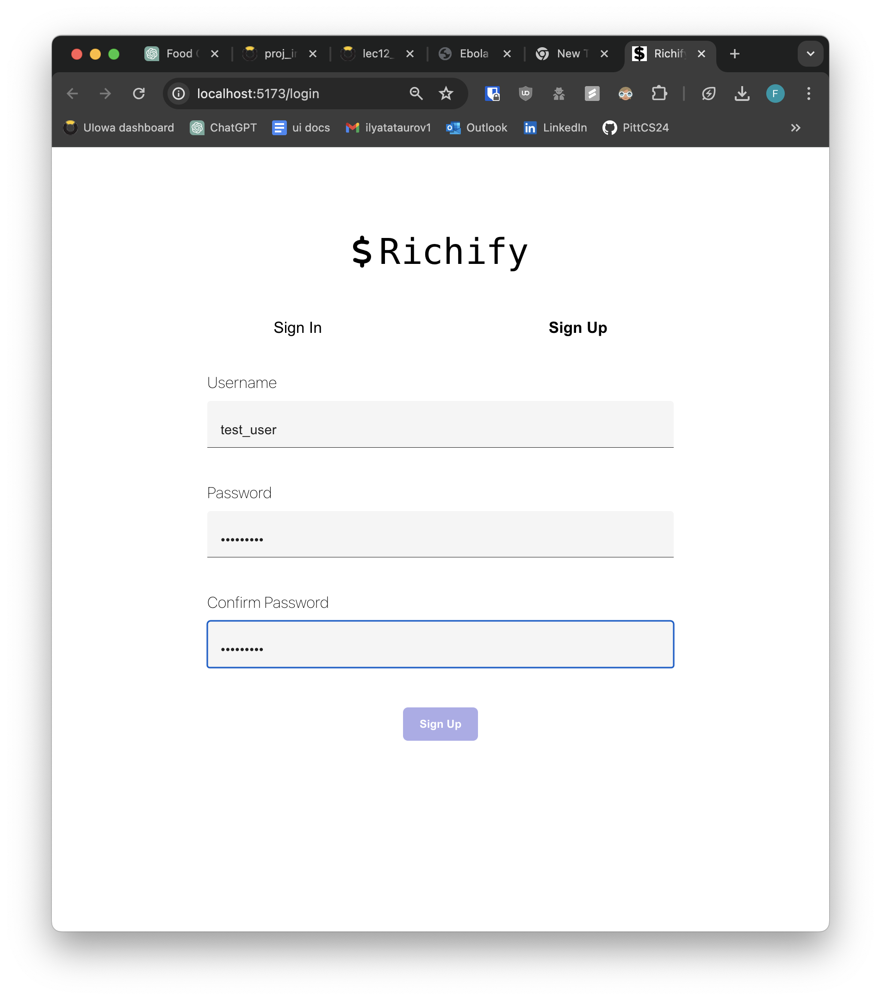
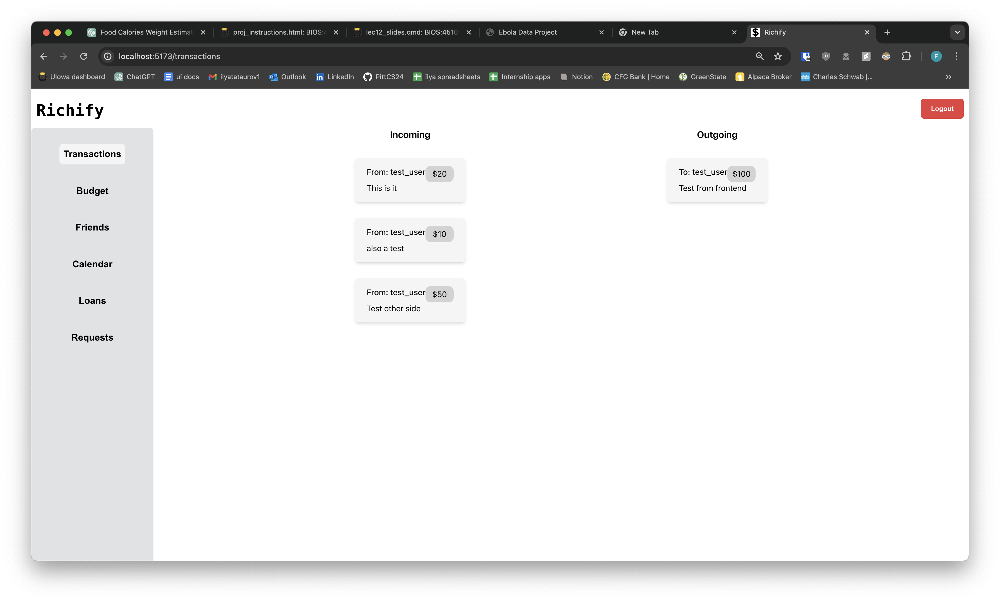
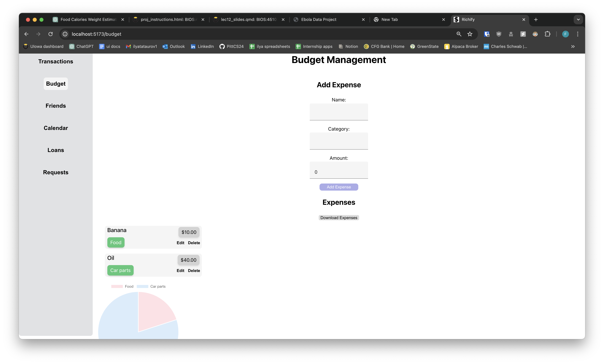
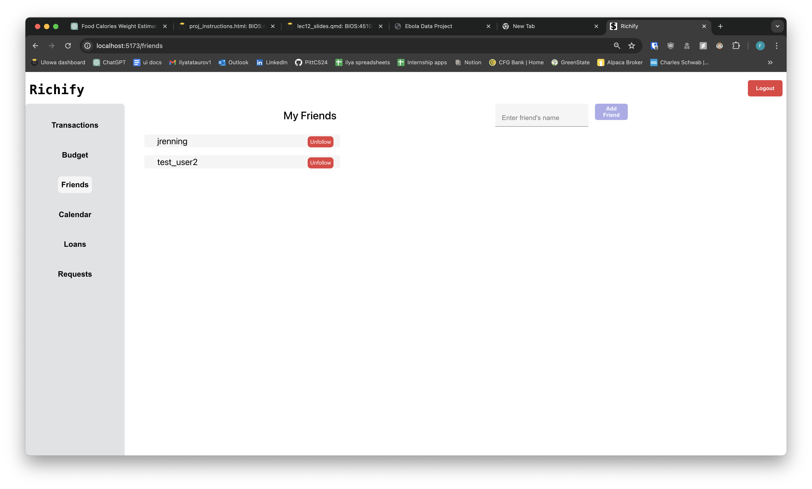
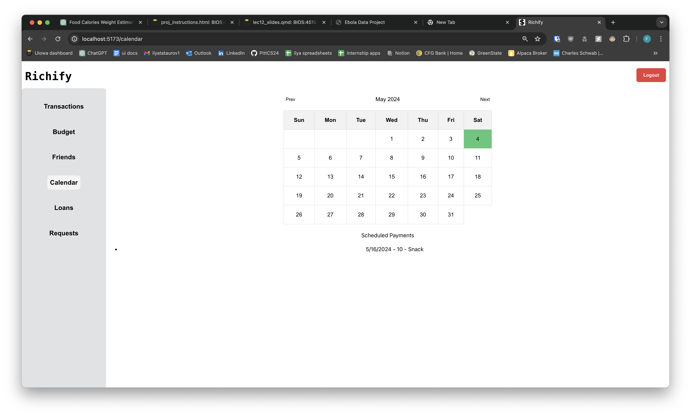
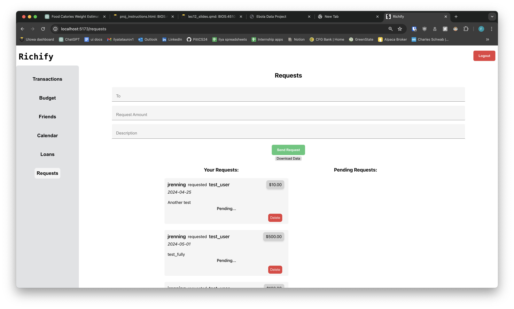

# CS3980-Final-Project
This is the README file for the final project for CS:3980 for the Spring 2024 semester.
This project serves as a web application for tracking personal debts.

## TODO

Backend 
- [ ] Testing (required)
    - [ ] Setup pytest 
    - [ ] Implement testing using https://fastapi.tiangolo.com/tutorial/testing/
- [x] Logs (required)
    - [x] Implement logging to file, see teacher's Github for examples
- Admin features (required)
    - [ ] Allow admin to block users from doing transactions / other abilities
- [ ] Features
    - [x] Account creation
        - [x] Sign in
        - [x] Sign up
    - [x] Payments
        - [x] Ability to create payment 
            - [ ] For loan
            - [x] For regular transaction 
        - [x] Ability to approve payment
            - [x] Change getting payments to only show ones that are approved
        - [x] Ability to download record of payments (half-done) (required)
        - [ ] Ability to make payment plans (stretch goal)
        - [ ] Uploading transactions records (stretch goal)
    - [ ] Loans
        - [x] Ability to upload documents with loan (required)
        - [x] Create loan
        - [ ] Ability to change loan status, from open to closed 
        - [x] Cancel loan (only available for user who gave the loan if from another user)
        - [ ] Edit loan details (^^)
    - [ ] Budget
        - [x] Ability to create a budget
            - [x] Ability to add expense
            - [x] Adding category
            - [x] Adding initial budget object (just no expenses)
        - [x] Ability to edit a budget
            - [x] Edit expense
            - [x] Edit budget categories, name and %
        - [x] Getting budget data for user
            - ~~[ ] Handle if user has multiple budgets~~
        - [ ] Deleting budget
    - [ ] Users
        - [x] Add friends
        - [x] Get friends
        - [x] Remove friends
        - [ ] Block people

Frontend
- [ ] Features
    - [ ] Dashboard ()
        - [ ] Add summary stuff to dashboard
            - [ ] Total transactions?
            - [ ] Expense graphs from budget (ok if they repeat)
            - [ ] If budget is on track 
            - [ ] etc
    - [ ] Transactions
        - [x] Clean up UI
        - [x] Fix columns for incoming and outgoing 
        - **Note: don't need remove / edit, only maybe applicable for admin users
        - [ ] Fetch all users list and make form username field a select from existing users
    - [ ] Loans
        - Clean up UI
            - [x] Styled form
        - [ ] Add ability to delete / edit (if allowed)
        - [ ] Fetch all users list and make form username field a select from existing users
        - [x] Add field to form to upload documents
        - [x] Add ability to download / delete loan documents 
    - [ ] Calendar (this might need to be cut for time)
        - [ ] If we do payment plans add those 
    - [ ] Friends
        - [x] Add form to add friend 
            - [ ] Fetch list of users and use select
        - [ ] Add ability to quickly send transaction
        - [x] Add ability to unfollow 
        - [x] Add delete 
        - [x] Clean up UI
    - [x] Requests 
        - [x] Add ability to approve payment 
        - [x] Add ability to delete your requests 
    - [ ] General
        - [x] Make it so user can't see data unless they're signed in 
        - [x] Redirect to login page if not signed in 
        - [ ] General UI cleanup

## How to Run

This application has a separate server for the frontend and backend. To run the full applications both must be running on the same computer on localhost.

### Backend
First, create a virtual environment with
`python -m venv venv`,
and open it with
`.\venv\Scripts\activate`.

Then install the necessary packages with
`pip install -r requirements.txt`.

Finally, start the program with
`uvicorn main:app --port 8000 --reload`.

### Frontend 
First, install the packages with
`npm install`
then run the frontend using 
`npm run dev`

To create a build of the frontend that can be deployed as a static site you can run 
`npm run build`

## main.py
This is the Python code that runs the website. It uses FastAPI for the app and Starlette for the file responses.

## Features

- Request money from other users, they can approve or decline
- Keep track of existing loans and their amounts as well as any important documemts
- Add other users as friends to keep up on who you interact with the most
- View a calender with the option of scheduling future payments to keep on top of your finances
- View, and download, a history of all your transactions, allows for easy personal record keeping online or on paper
- Keep track of what your spending money on with the budget feature. This allows you to enter your expenses in given categories and see the results summed in a nice graph
- All of these features are tied to your personal account using a username and password

## Pictures

### Sign Up Page

### Transactions

### Budget

### Friends

### Calendar

### Loans

### Requests
